#### [1. 两数之和](https://leetcode.cn/problems/two-sum/)

#### **难度简单**

给定一个整数数组 `nums` 和一个整数目标值 `target`，请你在该数组中找出 **和为目标值** *`target`*  的那 **两个** 整数，并返回它们的数组下标。

你可以假设每种输入只会对应一个答案。但是，数组中同一个元素在答案里不能重复出现。

你可以按任意顺序返回答案。

**示例 1：**

```
输入：nums = [2,7,11,15], target = 9
输出：[0,1]
解释：因为 nums[0] + nums[1] == 9 ，返回 [0, 1] 。
```

**示例 2：**

```
输入：nums = [3,2,4], target = 6
输出：[1,2]
```

**示例 3：**

```
输入：nums = [3,3], target = 6
输出：[0,1]
```

**提示：**

- `2 <= nums.length <= 10^4`
- `-10^9 <= nums[i] <= 10^9`
- `-10^9 <= target <= 10^9`
- **只会存在一个有效答案**

进阶：你可以想出一个时间复杂度小于 `O(n2)` 的算法吗？

#

## 两数之和

### 题目描述

给定一个整数数组 `nums` 和一个整数目标值 `target`，请你在该数组中找出和为目标值 `target` 的那两个整数，并返回它们的数组下标。

你可以假设每种输入只会对应一个答案。但是，数组中同一个元素在答案里不能重复出现。

你可以按任意顺序返回答案。

### 示例

**输入：**

```python
nums = [2, 7, 11, 15]
target = 9
```

**输出：**

```python
[0, 1]
```

**解释：**

因为 `nums[0] + nums[1] = 2 + 7 = 9`，所以返回 `[0, 1]`。

### 解题思路

这道题要求找出数组中两个数的和等于目标值 `target`，并返回它们的下标。我们可以通过两种方法来解决这个问题。

#### 解法一：暴力法

最直观的解法是使用两层循环遍历数组中的每对数字，判断它们的和是否等于目标值。具体步骤如下：

1. 使用两个嵌套循环遍历数组 `nums`。
2. 对于当前遍历到的两个数字 `nums[i]` 和 `nums[j]`，判断它们的和是否等于目标值 `target`。
3. 如果等于目标值，则返回两个数字的下标 `[i, j]`。

该方法的时间复杂度是 O(n^2)，其中 n 是数组的长度。

#### 解法二：哈希表

为了降低时间复杂度，我们可以使用哈希表（字典）来存储已经遍历过的数字及其对应的索引。具体步骤如下：

1. 创建一个空的哈希表 `num_dict`。
2. 遍历数组 `nums`，对于当前遍历到的数字 `nums[i]`，执行以下操作：
  - 计算目标值与当前数字的差值 `complement = target - nums[i]`。
  - 判断差值 `complement` 是否在哈希表 `num_dict` 中存在：
    - 如果存在，则说明找到了两个数的和为目标值，返回差值的索引 `num_dict[complement]` 和当前数字的索引 `i`。
    - 如果不存在，则将当前数字及其索引存入哈希表 `num_dict`。
3. 如果遍历结束后仍未找到符合条件的两个数，则返回一个空的列表 `[]`。

该方法的时间复杂度是 O(n)，因为在哈希表中进行查找的时间复

杂度是 O(1)，并且只需遍历一次数组。

### 代码实现

下面是使用 Python 实现上述两种解法的代码：

```python
class Solution:
    def twoSum(self, nums, target):
        """
        :type nums: List[int]
        :type target: int
        :rtype: List[int]
        """
        # 解法一：暴力法
        # n = len(nums)
        # for i in range(n):
        #     for j in range(i + 1, n):
        #         if nums[i] + nums[j] == target:
        #             return [i, j]

        # 解法二：哈希表
        num_dict = {}
        for i, num in enumerate(nums):
            complement = target - num
            if complement in num_dict:
                return [num_dict[complement], i]
            num_dict[num] = i

# 创建实例
solution = Solution()

# 示例输入
nums = [2, 7, 11, 15]
target = 9

# 调用方法
result = solution.twoSum(nums, target)

# 打印结果
print(result)
```



### 复杂度分析

- 时间复杂度：解法一的暴力法时间复杂度是 O(n^2)，解法二的哈希表方法时间复杂度是 O(n)。
- 空间复杂度：解法一的暴力法空间复杂度是 O(1)，解法二的哈希表方法空间复杂度是 O(n)，其中 n 是数组的长度。

通过使用哈希表，在牺牲一定的空间复杂度的情况下，我们能够在较低的时间复杂度内解决这个问题。因此，解法二是一种更优的解法。

### **进阶：**

当进一步优化算法以降低时间复杂度时，我们可以尝试使用一次遍历完成任务。下面介绍一种时间复杂度为 `O(n)` 的解法。

#### 解法三：一遍哈希表

该方法通过一次遍历完成，在遍历过程中，使用哈希表记录已经遍历过的数字及其索引。对于当前遍历到的数字 `nums[i]`，我们判断目标值与当前数字的差值 `complement = target - nums[i]` 是否在哈希表中存在，如果存在，则说明找到了两个数的和为目标值。

具体步骤如下：

1. 创建一个空的哈希表 `num_dict`。
2. 遍历数组 `nums`，对于当前遍历到的数字 `nums[i]`，执行以下操作：
  - 计算目标值与当前数字的差值 `complement = target - nums[i]`。
  - 判断差值 `complement` 是否在哈希表 `num_dict` 中存在：
    - 如果存在，则说明找到了两个数的和为目标值，返回差值的索引 `num_dict[complement]` 和当前数字的索引 `i`。
    - 如果不存在，则将当前数字及其索引存入哈希表 `num_dict`。
3. 如果遍历结束后仍未找到符合条件的两个数，则返回一个空的列表 `[]`。

该方法只需遍历一次数组，时间复杂度为 `O(n)`。

下面是使用 Python 实现解法三的代码：

```python
class Solution:
    def twoSum(self, nums, target):
        """
        :type nums: List[int]
        :type target: int
        :rtype: List[int]
        """
        num_dict = {}
        for i, num in enumerate(nums):
            complement = target - num
            if complement in num_dict:
                return [num_dict[complement], i]
            num_dict[num] = i

# 创建实例
solution = Solution()

# 示例输入
nums = [2, 7, 11, 15]
target = 9

# 调用方法
result = solution.twoSum(nums, target)

# 打印结果
print(result)
```



这样，我们就成功地实现了一个时间复杂度小于 `O(n^2)` 的算法。

### 再优化..?

为了进一步优化内存消耗和运行速度，可以对解法三进行微调。具体优化如下：

#### 解法四：一遍哈希表优化

该优化方法在解法三的基础上进行微调，以降低内存消耗和提高运行速度。

具体优化如下：

1. 在遍历数组 `nums` 的同时，判断当前数字 `nums[i]` 在哈希表 `num_dict` 中是否存在对应的索引值，即 `nums[i]` 是否在 `num_dict` 的键集合中。
2. 如果存在，则说明找到了两个数的和为目标值，直接返回哈希表中的索引值和当前遍历的索引值 `[num_dict[nums[i]], i]`。
3. 如果不存在，则将当前数字 `nums[i]` 及其索引值 `i` 存入哈希表 `num_dict` 中。

优化后的代码如下所示：

```python
class Solution:
    def twoSum(self, nums, target):
        """
        :type nums: List[int]
        :type target: int
        :rtype: List[int]
        """
        num_dict = {}
        for i, num in enumerate(nums):
            if num in num_dict:
                return [num_dict[num], i]
            num_dict[target - num] = i

# 创建实例
solution = Solution()

# 示例输入
nums = [2, 7, 11, 15]
target = 9

# 调用方法
result = solution.twoSum(nums, target)

# 打印结果
print(result)
```



通过这种优化，可以降低内存消耗并略微提高运行速度。

### 别的思路？

#### 思路：差值查找

我们可以利用数学性质来解决这个问题。观察题目要求，我们需要找到两个数的和等于目标值 `target`。假设找到了两个数 `a` 和 `b`，它们的和等于 `target`，即 `a + b = target`。

我们可以将这个等式稍作变形，写成 `a = target - b`。这个变形的意义是，我们可以通过固定一个数 `b`，然后在数组中查找是否存在数 `a`，满足 `a = target - b`。

具体步骤如下：

1. 创建一个空的字典 `num_dict`。
2. 遍历数组 `nums`，对于当前遍历到的数字 `num`，执行以下操作：
  - 计算差值 `diff = target - num`。
  - 判断差值 `diff` 是否在字典 `num_dict` 中存在：
    - 如果存在，则说明找到了两个数的和为目标值，返回字典中的索引值 `[num_dict[diff], i]`。
    - 如果不存在，则将当前数字 `num` 存入字典 `num_dict` 中，索引值为 `i`。
3. 如果遍历结束后仍未找到符合条件的两个数，则返回一个空的列表 `[]`。

这种方法利用了差值查找的思想，通过固定一个数，将问题转化为查找另一个数的问题，进而降低了时间复杂度。

下面是使用差值查找思路的代码：

```python
class Solution:
    def twoSum(self, nums, target):
        """
        :type nums: List[int]
        :type target: int
        :rtype: List[int]
        """
        num_dict = {}
        for i, num in enumerate(nums):
            diff = target - num
            if diff in num_dict:
                return [num_dict[diff], i]
            num_dict[num] = i

# 创建实例
solution = Solution()

# 示例输入
nums = [2, 7, 11, 15]
target = 9

# 调用方法
result = solution.twoSum(nums, target)

# 打印结果
print(result)
```




这种思路与哈希表的解法类似，但是通过差值查找的方式，可能会给你带来一些新的思考。

#### 思路：排序与双指针

该方法利用了排序和双指针的思想来解决问题。具体步骤如下：

1. 创建一个字典 `num_dict`，用于存储数组中的数字及其对应的索引。
2. 对数组 `nums` 进行排序。
3. 初始化两个指针 `left` 和 `right`，分别指向数组的开头和末尾。
4. 当 `left` 小于 `right` 时，执行以下操作：
  - 计算指针所指的两个数字的和 `sum_nums = nums[left] + nums[right]`。
  - 如果 `sum_nums` 等于目标值 `target`，则返回指针的索引 `[left, right]`。
  - 如果 `sum_nums` 大于目标值 `target`，则将右指针向左移动一位，即 `right = right - 1`。
  - 如果 `sum_nums` 小于目标值 `target`，则将左指针向右移动一位，即 `left = left + 1`。
5. 如果遍历结束后仍未找到符合条件的两个数，则返回一个空的列表 `[]`。

这种方法首先对数组进行排序，然后使用双指针从两端逐步逼近目标值，通过比较指针所指数字的和与目标值的大小关系，来确定指针的移动方向。由于数组已经排序，可以利用排序的特性快速定位目标值。

下面是使用排序与双指针的方法的代码：

```python
class Solution:
    def twoSum(self, nums, target):
        """
        :type nums: List[int]
        :type target: int
        :rtype: List[int]
        """
        n = len(nums)
        sorted_nums = sorted(nums)
        left = 0
        right = n - 1
        while left < right:
            sum_nums = sorted_nums[left] + sorted_nums[right]
            if sum_nums == target:
                break
            elif sum_nums < target:
                left += 1
            else:
                right -= 1

        # 在原数组中查找对应的索引
        index_left = nums.index(sorted_nums[left])
        index_right = nums.index(sorted_nums[right], index_left + 1)

        return [index_left, index_right]

# 创建实例
solution = Solution()

# 示例输入
nums = [2, 7, 11, 15]
target = 9

# 调用方法
result = solution.twoSum(nums, target)

# 打印结果
print(result)
```




这种方法结合了排序和双指针的思想，通过将问题转化为在排序后的数组中查找两个数的问题，进一步提高了算法的效率。