#### [2. 两数相加](https://leetcode.cn/problems/add-two-numbers/)

####**难度中等**

给你两个 **非空** 的链表，表示两个非负的整数。它们每位数字都是按照 **逆序** 的方式存储的，并且每个节点只能存储 **一位** 数字。

请你将两个数相加，并以相同形式返回一个表示和的链表。

你可以假设除了数字 0 之外，这两个数都不会以 0 开头。

**示例 1：**


**输入：**l1 = [2,4,3], l2 = [5,6,4]
**输出：**[7,0,8]
**解释：**342 + 465 = 807.

**示例 2：**

**输入：**l1 = [0], l2 = [0]
**输出：**[0]

**示例 3：**

**输入：**l1 = [9,9,9,9,9,9,9], l2 = [9,9,9,9]
**输出：**[8,9,9,9,0,0,0,1]

**提示：**

- 每个链表中的节点数在范围 `[1, 100]` 内
- `0 <= Node.val <= 9`
- 题目数据保证列表表示的数字不含前导零

这道题要求实现一个函数，将两个链表表示的逆序整数相加，并返回相加后的链表。

首先，我们需要明确链表的数据结构。题目中已经给出了链表节点的定义：

```python
class ListNode(object):
    def __init__(self, val=0, next=None):
        self.val = val
        self.next = next
```

链表中的每个节点包含一个整数值 `val` 和一个指向下一个节点的指针 `next`。

接下来，我们可以使用迭代的方式实现相加的过程。我们从链表的头节点开始遍历，逐位相加，并将结果保存在新的链表中。同时，需要记录进位值，以便在下一位相加时加上进位。

具体的实现步骤如下：

1. 初始化一个新的链表 `dummy_head` 作为相加结果的头节点，以及一个变量 `carry` 用于记录进位值，初始值为 0。
2. 遍历两个链表 `l1` 和 `l2`，同时遍历它们的对应位上的节点。若其中一个链表已经遍历完，则将其剩余的部分视为 0。
3. 计算当前位的和 `sum_val`，等于节点 `l1` 的值加上节点 `l2` 的值再加上进位值 `carry`。
4. 更新进位值 `carry`，等于 `sum_val` 除以 10 的商，即 `sum_val // 10`。
5. 创建一个新的节点 `new_node`，值为 `sum_val` 对 10 取余的结果，即 `sum_val % 10`，并将其连接到结果链表的末尾。
6. 将节点 `l1` 和节点 `l2` 都向后移动一位，继续下一位的相加。
7. 重复步骤 3-6，直到两个链表都遍历完。
8. 若遍历结束后进位值 `carry` 大于 0，则创建一个值为 `carry` 的新节点，并将其连接到结果链表的末尾。
9. 返回结果链表的头节点 `dummy_head.next`，即为最终的相加结果。

下面是实现的代码：

```python
class Solution(object):
    def addTwoNumbers(self, l1, l2):
        dummy_head = ListNode(0)  # 创建相加结果的头节点
        curr = dummy_head  # 当前节点
        carry = 0  # 进位值

        while l1 or l2:
            # 获取节点的值，若节点已经遍历完，则视其值为 0
            val1 = l1.val if l1 else 0
            val2 = l2.val if l2 else 0

            # 计算当前位的和与进位
            sum_val = val1 + val2 + carry
            carry = sum_val // 10

            # 创建新的节点，并连接到结果链表的末尾
            new_node = ListNode(sum_val % 10)
            curr.next =

 new_node
            curr = curr.next

            # 将 l1 和 l2 都向后移动一位
            if l1:
                l1 = l1.next
            if l2:
                l2 = l2.next

        # 若最高位有进位，则创建一个新节点
        if carry > 0:
            curr.next = ListNode(carry)

        return dummy_head.next  # 返回结果链表的头节点
```



时间复杂度分析：

- 遍历两个链表的时间复杂度为 O(max(m, n))，其中 m 和 n 分别为两个链表的长度。
- 创建新节点的时间复杂度为 O(max(m, n))。
- 因此，总时间复杂度为 O(max(m, n))。

空间复杂度分析：

- 创建了一个新链表作为相加的结果，其空间复杂度为 O(max(m, n))。
- 因此，总空间复杂度为 O(max(m, n))。

### 优化：

当然，我们可以进行一些优化。目前的解法是使用迭代的方式进行相加，每一位都计算并创建新的节点。但是我们可以通过在原链表上进行修改来避免创建新节点，从而节省空间。

具体的优化步骤如下：

1. 定义一个变量 `dummy_head` 作为相加结果的头节点，并定义两个指针 `curr` 和 `prev`，初始时都指向 `dummy_head`。
2. 遍历两个链表 `l1` 和 `l2`，同时遍历它们的对应位上的节点。若其中一个链表已经遍历完，则将其剩余的部分视为 0。
3. 计算当前位的和 `sum_val`，等于节点 `l1` 的值加上节点 `l2` 的值再加上进位值 `carry`。
4. 更新进位值 `carry`，等于 `sum_val` 除以 10 的商，即 `sum_val // 10`。
5. 更新当前节点 `curr` 的值，为 `sum_val` 对 10 取余的结果，即 `sum_val % 10`。
6. 将当前节点 `curr` 连接到前一个节点 `prev` 的后面。
7. 更新指针 `prev` 和 `curr`，将它们都向后移动一位，继续下一位的相加。
8. 重复步骤 3-7，直到两个链表都遍历完。
9. 若遍历结束后进位值 `carry` 大于 0，则创建一个值为 `carry` 的新节点，并将其连接到当前节点 `curr` 的后面。
10. 返回结果链表的头节点 `dummy_head.next`，即为最终的相加结果。

下面是优化后的代码：

```python
class Solution(object):
    def addTwoNumbers(self, l1, l2):
        dummy_head = ListNode(0)  # 创建相加结果的头节点
        curr = dummy_head  # 当前节点
        carry = 0  # 进位值

        while l1 or l2:
            # 获取节点的值，若节点已经遍历完，则视其值为 0
            val1 = l1.val if l1 else 0
            val2 = l2.val if l2 else 0

            # 计算当前位的和与进位
            sum_val = val1 + val2 + carry
            carry = sum_val // 10

            # 更新当前节点的值
            curr.val = sum_val % 10

            # 创建新的节点，并连接到当前节点的后面
            curr.next = ListNode(0)

            # 更新指针
            prev = curr
            curr = curr.next

            # 将 l1 和 l2 都向后移动一位
            if l1:
                l1 = l1.next
            if l2:
                l2 = l2.next

        # 若最高位有进位，则创建一个新节点
        if carry > 0:
            curr.val = carry
        else:
            prev.next = None

        return dummy_head  # 返回结果链表的头节点
```

这种优化方法可以避免创建新节点，直接在原链表上进行修改，节省了额外的空间。时间复杂度和空间复杂度与之前的解法相同，都是 O(max(m, n))。

如果想进一步优化时间，可以考虑以下几点：

1. 遍历链表时，不需要同时遍历两个链表。可以将两个链表对应位置的节点值相加，再加上进位值。
2. 对于进位值，可以直接累加到下一位的相加操作中，而不需要在每一位进行单独的处理。
3. 若两个链表的长度不一致，可以将较短链表的剩余部分视为值为 0 的节点。
4. 当遍历完两个链表后，若进位值仍大于 0，说明还需要添加一个新的节点来表示最高位的进位。

下面是优化后的代码：

```python
class Solution(object):
    def addTwoNumbers(self, l1, l2):
        dummy_head = ListNode(0)  # 创建相加结果的头节点
        curr = dummy_head  # 当前节点
        carry = 0  # 进位值

        while l1 or l2:
            # 获取节点的值，若节点已经遍历完，则视其值为 0
            val1 = l1.val if l1 else 0
            val2 = l2.val if l2 else 0

            # 计算当前位的和与进位，并更新进位值
            sum_val = val1 + val2 + carry
            carry = sum_val // 10

            # 创建新的节点，并连接到当前节点的后面
            curr.next = ListNode(sum_val % 10)

            # 更新指针
            curr = curr.next

            # 将 l1 和 l2 都向后移动一位
            if l1:
                l1 = l1.next
            if l2:
                l2 = l2.next

        # 若最高位有进位，则创建一个新节点
        if carry > 0:
            curr.next = ListNode(carry)

        return dummy_head.next  # 返回结果链表的头节点
```

这种优化方法避免了同时遍历两个链表，减少了一些不必要的操作。时间复杂度仍然为 O(max(m, n))，但在实际执行中可能会稍微快一些。

如果可以牺牲一些速度和内存消耗，可以考虑以下方法：

1. 将链表转换为整数：首先遍历两个链表，将它们分别转换为对应的整数，可以使用字符串拼接的方式将逆序的数字转换为正序的字符串表示。然后将这两个整数相加得到结果。
2. 将整数转换为链表：将相加得到的整数转换为链表的形式，逆序存储每一位数字，并返回相应的链表。

下面是具体的实现代码：

```python
class Solution(object):
    def addTwoNumbers(self, l1, l2):
        # 将链表转换为整数
        num1 = self.listToNum(l1)
        num2 = self.listToNum(l2)

        # 相加得到结果
        total = num1 + num2

        # 将整数转换为链表
        return self.numToList(total)

    def listToNum(self, head):
        num_str = ''
        curr = head
        while curr:
            num_str += str(curr.val)
            curr = curr.next
        return int(num_str[::-1])

    def numToList(self, num):
        if num == 0:
            return ListNode(0)

        dummy_head = ListNode(0)
        curr = dummy_head
        while num > 0:
            digit = num % 10
            curr.next = ListNode(digit)
            curr = curr.next
            num //= 10

        return dummy_head.next
```



### Hmm...

这种方法通过将链表转换为整数，进行整数相加，再将结果转换为链表的方式来解决问题。这种方法的时间复杂度和空间复杂度与输入的链表长度相关，但是在实际执行中可能会更慢，并且可能占用更多的内存空间。因此，如果要求更高的执行效率和内存优化，建议使用之前的方法。

如果想要使用一些好玩的方法来解决这个问题，可以考虑使用递归的方式来实现链表的相加操作。下面是一个使用递归的方法：

```python
class Solution(object):
    def addTwoNumbers(self, l1, l2):
        return self.addLists(l1, l2, 0)

    def addLists(self, l1, l2, carry):
        if not l1 and not l2:
            if carry > 0:
                return ListNode(carry)
            else:
                return None

        val1 = l1.val if l1 else 0
        val2 = l2.val if l2 else 0
        sum_val = val1 + val2 + carry
        digit = sum_val % 10
        carry = sum_val // 10

        next1 = l1.next if l1 else None
        next2 = l2.next if l2 else None

        node = ListNode(digit)
        node.next = self.addLists(next1, next2, carry)

        return node
```



这个方法使用递归函数 `addLists` 来实现链表的相加操作。在每一次递归调用中，我们将当前位的数值计算出来，并创建一个新的节点。然后，递归调用 `addLists` 函数来处理下一位的相加，并将返回的结果作为当前节点的下一个节点。当两个链表都遍历完并且没有进位时，递归结束。