#### [2451. 差值数组不同的字符串](https://leetcode.cn/problems/odd-string-difference/)

难度简单

给你一个字符串数组 `words` ，每一个字符串长度都相同，令所有字符串的长度都为 `n` 。

每个字符串 `words[i]` 可以被转化为一个长度为 `n - 1` 的 **差值整数数组** `difference[i]` ，其中对于 `0 <= j <= n - 2` 有 `difference[i][j] = words[i][j+1] - words[i][j]` 。注意两个字母的差值定义为它们在字母表中 **位置** 之差，也就是说 `'a'` 的位置是 `0` ，`'b'` 的位置是 `1` ，`'z'` 的位置是 `25` 。

- 比方说，字符串 `"acb"` 的差值整数数组是 `[2 - 0, 1 - 2] = [2, -1]` 。

`words` 中所有字符串 **除了一个字符串以外** ，其他字符串的差值整数数组都相同。你需要找到那个不同的字符串。

请你返回 `words`中 **差值整数数组** 不同的字符串。

**示例 1：**

**输入：**words = ["adc","wzy","abc"]
**输出：**"abc"
**解释：**

- "adc" 的差值整数数组是 [3 - 0, 2 - 3] = [3, -1] 。
- "wzy" 的差值整数数组是 [25 - 22, 24 - 25]= [3, -1] 。
- "abc" 的差值整数数组是 [1 - 0, 2 - 1] = [1, 1] 。
  不同的数组是 [1, 1]，所以返回对应的字符串，"abc"。

**示例 2：**

**输入：**words = ["aaa","bob","ccc","ddd"]
**输出：**"bob"
**解释：**除了 "bob" 的差值整数数组是 [13, -13] 以外，其他字符串的差值整数数组都是 [0, 0] 。

**提示：**

- `3 <= words.length <= 100`
- `n == words[i].length`
- `2 <= n <= 20`
- `words[i]` 只含有小写英文字母。

这是一个找出差值整数数组不同的字符串的问题。题目给定了一个字符串数组`words`，要求找出唯一一个差值整数数组与其他字符串不同的字符串。

我们可以通过遍历字符串数组`words`，计算每个字符串的差值整数数组，并将其与其他字符串的差值整数数组进行比较。找到不同的差值整数数组对应的字符串即可。

以下是实现的代码：

```python
class Solution(object):
    def oddString(self, words):
        n = len(words[0])
        diff_arrays = [self.calculate_diff_array(word, n) for word in words]
        for i in range(len(words)):
            is_different = True
            for j in range(len(words)):
                if j != i and diff_arrays[j] == diff_arrays[i]:
                    is_different = False
                    break
            if is_different:
                return words[i]

    def calculate_diff_array(self, word, n):
        diff_array = []
        for i in range(1, n):
            diff = ord(word[i]) - ord(word[i - 1])
            diff_array.append(diff)
        return diff_array
```

我们定义了一个`Solution`类，其中`oddString`方法接收一个字符串数组`words`并返回差值整数数组不同的字符串。

在`oddString`方法中，首先获取字符串的长度`n`，然后通过循环遍历字符串数组`words`，计算每个字符串的差值整数数组，并将其存储在`diff_arrays`列表中。

接下来，我们再次遍历字符串数组`words`，对于每个字符串，通过比较其差值整数数组与其他字符串的差值整数数组，判断是否存在相同的差值整数数组。如果不存在相同的差值整数数组，说明找到了不同的字符串，直接返回该字符串。

注意，在比较差值整数数组时，我们需要排除当前字符串本身，因此在内层循环中使用了条件`j != i`。

这个方法，时间复杂度为O(n^2)，其中n为字符串的长度。

